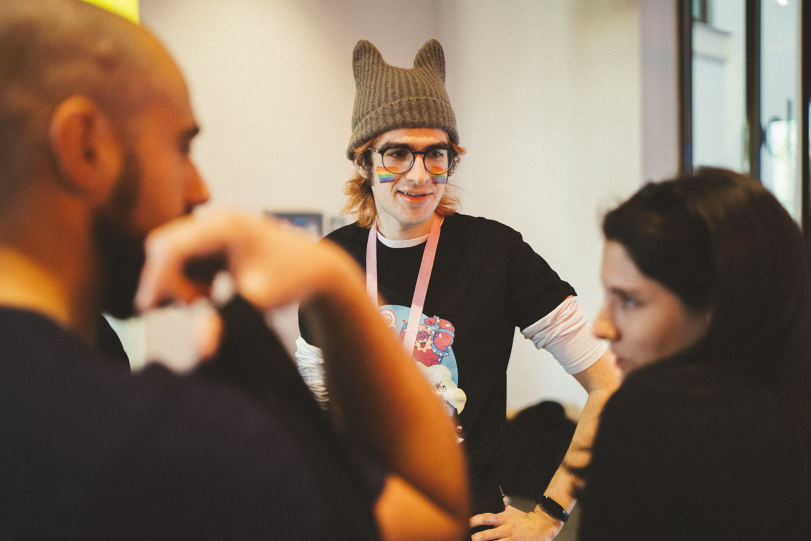

# Huzzah! Joser here! 🙌

## Video Game Software Engineer

🌈 they / them

🌐 English, Spanish

- 🌟 Focus on maintainability and extensibility, reducing the cost derived from continuous development.
- 📑 Cleanliness and readability of the code.
- 👩‍🔧 Continuously studying software development processes and applying them to video games.

### Connect with me!

[][linkedin]
[][twitter]

[linkedin]: https://www.linkedin.com/in/joserbala/
[twitter]: https://twitter.com/Joserbala

### Technologies I've been working with and enjoy

  
  
  
  
  
  
  
  
  
  

## Readings

You can check my software-related reading list on [Goodreads](https://www.goodreads.com/review/list/67951544?shelf=software) (column "read" will display a date if I've read the book).

## Activity

