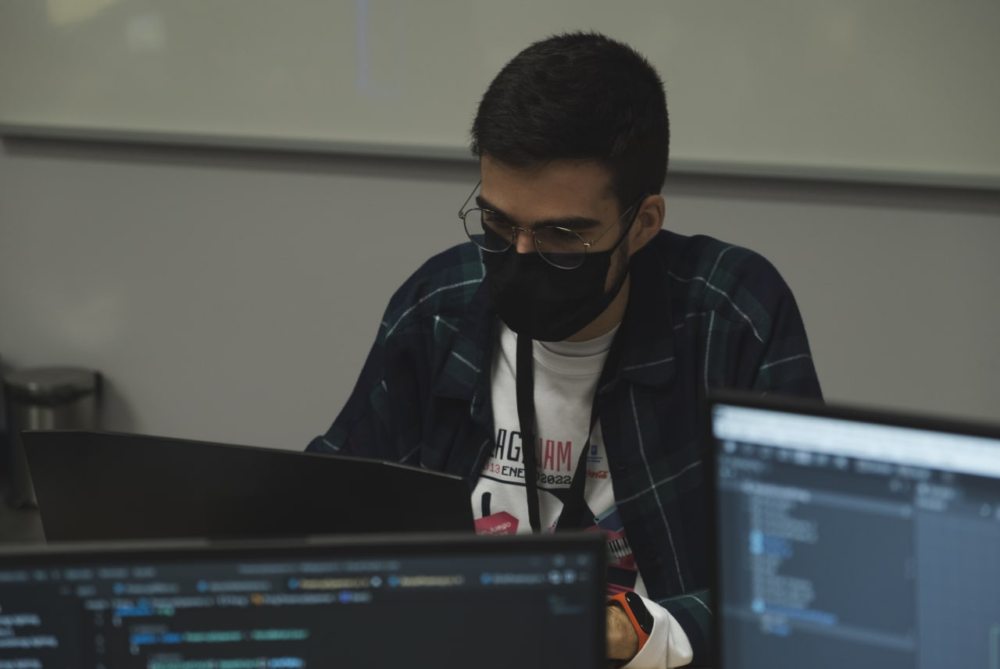

# Huzzah! Joser here! 🙌

## Video Game Software Engineer

🌈 they / them

🌐 English, Spanish

- 🌟 Focus on maintainability and extensibility, reducing the cost derived from continuous development.
- 📑 Cleanliness and readability of the code.
- 👩‍🔧 Continuously studying software development processes and applying them to video games.

### Connect with me!
[][linkedin]
[][twitter]

[linkedin]: https://www.linkedin.com/in/joserbala/
[twitter]: https://twitter.com/Joserbala

### Technologies I enjoy

  
  
  
  
  

 

  

<!--
### Hi there 👋
**Joserbala/joserbala** is a ✨ _special_ ✨ repository because its `README.md` (this file) appears on your GitHub profile.

Here are some ideas to get you started:

- 🔭 I’m currently working on ...
- 🌱 I’m currently learning ...
- 👯 I’m looking to collaborate on ...
- 🤔 I’m looking for help with ...
- 💬 Ask me about ...
- 📫 How to reach me: ...
- 😄 Pronouns: ...
- ⚡ Fun fact: ...
-->
